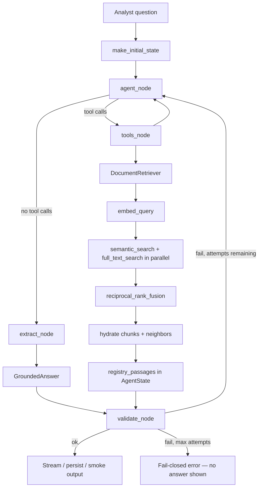

# Research pipeline: retrieval → agent → grounding

End-to-end flow for answering analyst questions from SEC filing chunks. Retrieval finds candidate passages; the LangGraph agent reads them via tools and produces a structured answer; grounding validates that every citation is real before the response is shown or persisted.

Retrieval-specific settings and SQL details live in [`../retrieval/README.md`](../retrieval/README.md).

## Full pipeline

The turn starts in `graph.py`, where `make_initial_state` initializes the LangGraph `StateGraph` with the analyst's question and the system prompt from `instructions.md`. The graph runs through four nodes:

1. **`agent_node`** — calls the LLM (bound to the four retrieval tools). If the model decides it has enough evidence it skips tools and moves to extract; otherwise it calls tools.
2. **`tools_node`** — executes tool calls from `tools.py`. Each tool delegates to `../retrieval/retriever.py`, which embeds the query, extracts full-text keywords, runs semantic and Postgres full-text search in parallel, fuses the rankings with RRF, hydrates the winning chunks, and includes nearby neighbor chunks by default. Every passage returned is appended to `registry_passages` in the graph state.
3. **`extract_node`** — calls the LLM a second time with `with_structured_output(GroundedAnswer)` to parse the final answer and citations into a typed `GroundedAnswer` from `outputs.py`.
4. **`validate_node`** — runs `GroundingValidator` against `registry_passages`. If validation fails and attempts remain, the graph loops back to `agent_node` with a correction message. After `MAX_VALIDATION_ATTEMPTS` the graph ends regardless.



## Agent layer

`DocumentRetriever` is wrapped by four tools in `tools.py`:

| Tool | Purpose |
| --- | --- |
| `search_filings` | Hybrid retrieval with optional `ticker`, `form`, `fiscal_years` filters |
| `read_chunks` | Batch-fetch full text for multiple chunk UUIDs in one DB round-trip |
| `read_chunk` | Fetch a single chunk by UUID |
| `read_surrounding_chunks` | Fetch adjacent chunks within the same filing |

Every tool returns a `Command` that appends retrieved passages to `registry_passages` in the graph state. That list is the **citation allowlist** for the turn — only chunk IDs registered here may appear in the final answer.

### Parallelism

| Layer | What runs in parallel |
| --- | --- |
| Retrieval | `semantic_search` and `full_text_search` use separate DB sessions in a thread pool |
| Agent tools | LangGraph's `ToolNode` executes all tool calls from a single model response concurrently |
| LLM rounds | Sequential — each model response waits for tool results before the next request |

Most wall time is LLM latency (the agent round plus the structured-output extraction round). Instructions steer the agent to answer from `search_filings` excerpts when possible, batch reads via `read_chunks`, and avoid redundant follow-up tool rounds.

### Structured output

`extract_node` calls the LLM with `with_structured_output(GroundedAnswer)` (`outputs.py`):

- `answer` — plain text with `[1]`, `[2]`, … markers
- `citations` — `{citation_index, chunk_id, excerpt}` per cited claim
- `insufficient_evidence` — when the corpus cannot support an answer (must have empty citations)

## Grounding

`GroundingValidator` (`grounding/validator.py`) runs inside `validate_node`. It is fail-closed: a failed validation either triggers a retry loop or causes the chat orchestrator to stream an error instead of the answer.

### Checks performed

1. **Non-empty answer** — blank `answer` text fails.
2. **Insufficient-evidence contract** — when `insufficient_evidence=true`, citations must be empty; when `false`, at least one citation is required.
3. **Registry populated** — citations cannot exist if no passages were retrieved.
4. **Citation indices** — must be unique, 1-based, and contiguous (`1..N`).
5. **Marker alignment** — every `[n]` in `answer` must match a `citation_index`, and vice versa.
6. **Chunk allowlist** — each `citation.chunk_id` must exist in `registry_passages`.
7. **Verbatim excerpts** — each `citation.excerpt` (whitespace-normalized) must be a substring of the retrieved chunk text. The model cannot paraphrase in excerpt fields.

### Where validation runs

| Entry point | Behavior on failure |
| --- | --- |
| `validate_node` in `graph.py` | Loops back to `agent_node` if attempts remain; orchestrator streams error otherwise |
| `scripts/smoke_assistant.py` | Prints `validation_ok: false` and the error message |

Grounding does **not** re-retrieve or re-score passages. It only checks that the model stayed inside the evidence boundary established by tool calls during the turn.

## Module map

| Path | Responsibility |
| --- | --- |
| `graph.py` | LangGraph `StateGraph` definition, node functions, `make_initial_state` |
| `state.py` | `AgentState` TypedDict, `registry_from_state` helper |
| `tools.py` | Retrieval-backed tools + `registry_passages` registration via `Command` |
| `deps.py` | `TurnRegistry` (citation allowlist built from state after the graph run) |
| `outputs.py` | `GroundedAnswer`, `Citation` |
| `instructions.md` | System prompt / product contract |
| `../retrieval/` | Hybrid search implementation |
| `../grounding/validator.py` | Post-extract citation validation |
| `../chat/orchestrator.py` | Graph → validate → stream → persist |

## Smoke test

From `backend/`:

```bash
uv run python -u scripts/smoke_assistant.py
```

Edit `QUERY_KEY` at the top of the script to switch between canned queries. The script calls `graph.ainvoke` directly, then runs the validator and prints the answer with citation metadata.
